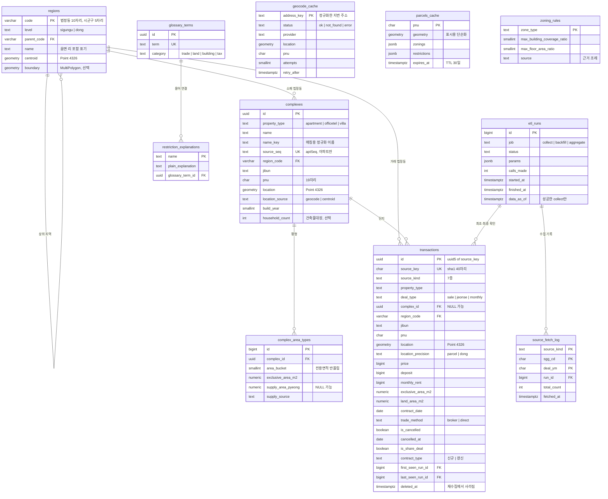
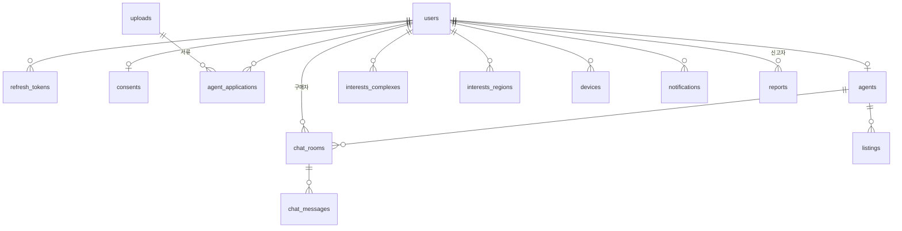

# DB 스키마 초안 (ERD, 이슈 #4)

PostgreSQL 16 + PostGIS 기준 **초안**입니다. 근거가 되는 실제 응답 조사는 [`API_RESEARCH.md`](./API_RESEARCH.md), API 계약은 [`API_SPEC.md`](./API_SPEC.md)를 봅니다.
1차(실거래가·토지·용어)는 DDL까지, 2·3차는 테이블 윤곽만 적었습니다. 확정 후 Alembic 마이그레이션으로 옮깁니다.

## 1. 원칙

1. 지역은 **법정동 코드**로 통일한다 (시군구 5자리 / 법정동 10자리).
2. 금액은 **원(bigint)**, 면적은 **㎡**로 저장한다. 원천의 만원·평 단위는 적재할 때 바꾼다.
3. 좌표는 `geometry(Point, 4326)` + GiST. **거리 조회는 `geography` 캐스팅**으로 미터 단위로 한다.
4. 거래는 `source_key`로 **멱등 upsert**한다. 원천에 삭제 신호가 없으므로 재수집에서 사라진 행은 **삭제 표시(`deleted_at`)** 한다.
5. 좌표는 서버가 지오코딩으로 만든다. 지번이 가려진 거래는 법정동 중심점에 두고 `location_precision='dong'`으로 표시한다.
6. 원천 응답의 의미를 바꾸는 가공(예: 갱신 계약·지분거래 제외)은 **저장 단계가 아니라 조회·집계 단계**에서 한다. 원천 값은 그대로 남긴다.

## 2. 1차 ERD



`geocode_cache`, `parcels_cache`, `zoning_rules`는 다른 테이블과 외래키로 묶이지 않는 독립 테이블이다.

## 3. 핵심 설계 결정

### 3.1 거래 자연키 `source_key`
원천에 거래 고유 ID가 없다. 아래 값을 `|`로 이어 SHA-1(40자리)로 만든다. 구현은 `RawTrade.source_key`(`backend/app/adapters/molit/types.py`).

| 구성 | 값 |
|---|---|
| 공통 | 종류, 시군구 코드, 법정동명, 지번, 건물명, 단지 식별자, 동, 층, 면적(전용 없으면 대지/거래), 계약일, 매매가, 보증금, 월세 |
| 마지막 | **순번** — 같은 응답 안에서 위 값이 완전히 같은 행(같은 날 같은 층 같은 금액)을 0, 1, 2…로 구분 |

- **넣지 않는 값**: 해제 여부·해제일, 등기일, 중개/직거래, 지목·용도지역. 나중에 바뀌므로 넣으면 같은 거래가 다른 키가 된다. (실제 응답으로 확인: 해제는 같은 행에 표시만 붙는다.)
- 키가 `transactions.id`(uuid5)의 원천이라 **다시 적재해도 같은 거래는 같은 id**다.
- 한계: 금액·면적 정정은 키가 바뀐다 → 3.2의 삭제 표시가 처리한다. 아파트 `aptDong`처럼 일부만 채워지는 필드는 그대로 키에 들어간다.

### 3.2 재수집과 삭제 표시
`source_fetch_log`는 (종류, 시군구, 계약월)마다 **마지막으로 끝까지 수집한 기록**이다. 이 단위로 다음을 한다.

1. 한 단위를 끝까지(모든 페이지) 받으면, 그 단위의 행을 upsert하면서 `last_seen_run_id = 이번 실행`으로 올린다.
2. 같은 단위에서 `last_seen_run_id`가 이번 실행이 아닌 행은 `deleted_at`을 채운다(정정으로 키가 바뀌었거나 원천에서 사라진 행).
3. 도중에 실패하거나 한도 초과로 끊기면 **그 단위는 2번을 하지 않는다**(일부만 받은 상태로 삭제 표시하면 안 된다).
4. 백필·한도 이월은 `source_fetch_log`에 없는 (종류, 시군구, 계약월)부터 이어서 한다.
5. 조회는 항상 `deleted_at IS NULL`이고, 기본은 `NOT is_cancelled`다.

### 3.3 단지 매칭
- 아파트: `aptSeq`(100%) → `complexes.source_seq`.
- 오피스텔·연립다세대: (시군구 → 법정동, 지번, **정규화한 건물명**) → `complexes`. 정규화는 공백·특수문자 제거 정도로 시작하고, 같은 지번에서 이름이 달라 갈라진 단지의 병합은 수동 보정 대상으로 둔다.
- 토지는 단지가 없다(`complex_id` NULL).
- 평형은 거래의 전용면적을 **반올림한 정수(㎡)** 로 묶는다(84.842와 84.97이 같은 평형). 공급 평형은 건축물대장이 확인될 때까지 NULL이다.

### 3.4 법정동 매핑
원천은 법정동명만 주고(코드는 아파트 매매만), 기장군은 리 단위(`기장읍 교리`)까지 온다. `regions`에 법정동 코드 마스터가 있어야 (시군구, 이름) → 코드를 찾을 수 있다. **마스터 출처가 정해지지 않았다**(열린 질문 1).

### 3.5 위치 정밀도
- 단지가 있는 거래: 단지 좌표를 쓰고 `location_precision='parcel'`.
- **토지: 지번이 100% 가려지므로 법정동 중심점 + `'dong'`**, `pnu`는 NULL이다.
- 지오코딩에 실패한 단지는 법정동 중심점으로 두고 `location_source='centroid'`, `geocode_cache`에 실패를 기록해 재시도한다.

### 3.6 통계에서 제외할 거래
저장은 하되 집계에서 거른다. 근거는 `API_RESEARCH.md` 4.2.

| 대상 | 컬럼 | 기본 집계 |
|---|---|---|
| 해제거래 | `is_cancelled` | **제외** (명세 확정) |
| 토지 지분거래 | `is_share_deal` | 제외 제안 |
| 토지 지목 '도로' | `jimok` | 제외 제안 |
| 갱신 계약(전월세) | `contract_type='갱신'` | 포함, **결정 필요** |
| 직거래 | `trade_method='direct'` | 요청 옵션(`exclude_direct`) |

## 4. 1차 DDL 초안

```sql
CREATE EXTENSION IF NOT EXISTS postgis;

CREATE TABLE regions (
    code        varchar(10) PRIMARY KEY,
    level       text NOT NULL CHECK (level IN ('sigungu', 'dong')),
    parent_code varchar(10) REFERENCES regions (code),
    name        text NOT NULL,
    centroid    geometry(Point, 4326),
    boundary    geometry(MultiPolygon, 4326),
    CHECK ((level = 'sigungu' AND length(code) = 5) OR (level = 'dong' AND length(code) = 10)),
    UNIQUE (parent_code, name)
);
CREATE INDEX regions_centroid ON regions USING gist (centroid);

CREATE TABLE etl_runs (
    id            bigint GENERATED ALWAYS AS IDENTITY PRIMARY KEY,
    job           text NOT NULL CHECK (job IN ('collect', 'backfill', 'aggregate')),
    status        text NOT NULL CHECK (status IN ('running', 'success', 'partial', 'failed', 'quota_exceeded')),
    params        jsonb NOT NULL DEFAULT '{}',
    started_at    timestamptz NOT NULL DEFAULT now(),
    finished_at   timestamptz,
    calls_made    int NOT NULL DEFAULT 0,
    rows_fetched  int NOT NULL DEFAULT 0,
    rows_inserted int NOT NULL DEFAULT 0,
    rows_updated  int NOT NULL DEFAULT 0,
    rows_cancelled int NOT NULL DEFAULT 0,
    rows_deleted  int NOT NULL DEFAULT 0,
    error         text,
    data_as_of    timestamptz
);

CREATE TABLE source_fetch_log (
    source_kind text NOT NULL,
    sgg_cd      char(5) NOT NULL,
    deal_ym     char(6) NOT NULL,
    run_id      bigint NOT NULL REFERENCES etl_runs (id),
    total_count int NOT NULL,
    fetched_at  timestamptz NOT NULL,
    PRIMARY KEY (source_kind, sgg_cd, deal_ym)
);

CREATE TABLE complexes (
    id               uuid PRIMARY KEY,
    property_type    text NOT NULL CHECK (property_type IN ('apartment', 'officetel', 'villa')),
    name             text NOT NULL,
    name_key         text NOT NULL,
    source_seq       text UNIQUE,
    region_code      varchar(10) NOT NULL REFERENCES regions (code),
    jibun            text NOT NULL,
    pnu              char(19),
    location         geometry(Point, 4326) NOT NULL,
    location_source  text NOT NULL CHECK (location_source IN ('geocode', 'centroid')),
    build_year       smallint,
    household_count  int,
    created_at       timestamptz NOT NULL DEFAULT now(),
    CHECK (source_seq IS NULL OR property_type = 'apartment')
);
CREATE UNIQUE INDEX complexes_natural_key ON complexes (property_type, region_code, jibun, name_key)
    WHERE source_seq IS NULL;
CREATE INDEX complexes_location ON complexes USING gist (location);
CREATE INDEX complexes_region ON complexes (region_code);

CREATE TABLE complex_area_types (
    id                 bigint GENERATED ALWAYS AS IDENTITY PRIMARY KEY,
    complex_id         uuid NOT NULL REFERENCES complexes (id) ON DELETE CASCADE,
    area_bucket        smallint NOT NULL,
    exclusive_area_m2  numeric(9, 3) NOT NULL,
    supply_area_pyeong numeric(6, 1),
    supply_source      text,
    UNIQUE (complex_id, area_bucket)
);

CREATE TABLE transactions (
    id                 uuid PRIMARY KEY,
    source_key         char(40) NOT NULL UNIQUE,
    source_kind        text NOT NULL CHECK (source_kind IN
                         ('apt_trade', 'apt_rent', 'offi_trade', 'offi_rent', 'rh_trade', 'rh_rent', 'land_trade')),
    property_type      text NOT NULL CHECK (property_type IN ('apartment', 'officetel', 'villa', 'land')),
    deal_type          text NOT NULL CHECK (deal_type IN ('sale', 'jeonse', 'monthly')),
    complex_id         uuid REFERENCES complexes (id),
    region_code        varchar(10) NOT NULL REFERENCES regions (code),
    jibun              text,
    pnu                char(19),
    location           geometry(Point, 4326) NOT NULL,
    location_precision text NOT NULL CHECK (location_precision IN ('parcel', 'dong')),
    price              bigint,
    deposit            bigint,
    monthly_rent       bigint,
    exclusive_area_m2  numeric(9, 3),
    land_area_m2       numeric(12, 2),
    basis_area_m2      numeric GENERATED ALWAYS AS (coalesce(exclusive_area_m2, land_area_m2)) STORED,
    floor              smallint,
    build_year         smallint,
    contract_date      date NOT NULL,
    trade_method       text CHECK (trade_method IN ('broker', 'direct')),
    is_cancelled       boolean NOT NULL DEFAULT false,
    cancelled_at       date,
    registered_date    date,
    is_share_deal      boolean NOT NULL DEFAULT false,
    jimok              text,
    land_use           text,
    house_type         text,
    contract_type      text,
    contract_term      text,
    use_renewal_right  boolean,
    first_seen_run_id  bigint NOT NULL REFERENCES etl_runs (id),
    last_seen_run_id   bigint NOT NULL REFERENCES etl_runs (id),
    deleted_at         timestamptz,
    updated_at         timestamptz NOT NULL DEFAULT now(),
    -- 전세는 원천의 월세 0을 NULL로 바꿔 넣는다
    CHECK ((deal_type = 'sale' AND price IS NOT NULL AND deposit IS NULL AND monthly_rent IS NULL)
        OR (deal_type = 'jeonse' AND price IS NULL AND deposit IS NOT NULL AND monthly_rent IS NULL)
        OR (deal_type = 'monthly' AND price IS NULL AND deposit IS NOT NULL AND monthly_rent IS NOT NULL)),
    CHECK (property_type <> 'land' OR deal_type = 'sale'),
    CHECK ((property_type = 'land') = (exclusive_area_m2 IS NULL)),
    CHECK (location_precision = 'parcel' OR pnu IS NULL)
);
CREATE INDEX transactions_map ON transactions (property_type, deal_type, contract_date DESC)
    WHERE deleted_at IS NULL AND NOT is_cancelled;
CREATE INDEX transactions_region ON transactions (region_code, property_type, deal_type, contract_date DESC)
    WHERE deleted_at IS NULL AND NOT is_cancelled;
CREATE INDEX transactions_complex ON transactions (complex_id, contract_date DESC)
    WHERE complex_id IS NOT NULL AND deleted_at IS NULL;
CREATE INDEX transactions_parcel_location ON transactions USING gist (location)
    WHERE location_precision = 'parcel' AND deleted_at IS NULL;
CREATE INDEX transactions_window ON transactions (source_kind, left(region_code, 5), contract_date)
    WHERE deleted_at IS NULL;

CREATE TABLE geocode_cache (
    address_key text PRIMARY KEY,
    status      text NOT NULL CHECK (status IN ('ok', 'not_found', 'error')),
    provider    text NOT NULL,
    location    geometry(Point, 4326),
    pnu         char(19),
    attempts    smallint NOT NULL DEFAULT 1,
    last_error  text,
    retry_after timestamptz,
    updated_at  timestamptz NOT NULL DEFAULT now()
);

CREATE TABLE parcels_cache (
    pnu                        char(19) PRIMARY KEY,
    jibun_address              text NOT NULL,
    land_category              text,
    land_area_m2               numeric(12, 2),
    official_land_price_per_m2 int,
    official_land_price_year   smallint,
    road_side                  text,
    shape                      text,
    geometry                   geometry(MultiPolygon, 4326) NOT NULL,
    zonings                    jsonb NOT NULL,
    restrictions               jsonb NOT NULL DEFAULT '[]',
    fetched_at                 timestamptz NOT NULL,
    expires_at                 timestamptz NOT NULL
);
CREATE INDEX parcels_cache_geometry ON parcels_cache USING gist (geometry);
CREATE INDEX parcels_cache_expiry ON parcels_cache (expires_at);

CREATE TABLE zoning_rules (
    zone_type                   text PRIMARY KEY,
    max_building_coverage_ratio smallint NOT NULL,
    max_floor_area_ratio        smallint NOT NULL,
    source                      text NOT NULL,
    effective_from              date NOT NULL,
    plain_explanation           text
);

CREATE TABLE glossary_terms (
    id               uuid PRIMARY KEY,
    term             text NOT NULL UNIQUE,
    category         text NOT NULL CHECK (category IN ('trade', 'land', 'building', 'tax')),
    is_popular       boolean NOT NULL DEFAULT false,
    display_order    int NOT NULL,
    short_definition text NOT NULL,
    long_definition  text NOT NULL,
    example          text NOT NULL,
    updated_at       timestamptz NOT NULL DEFAULT now()
);

CREATE TABLE restriction_explanations (
    name              text PRIMARY KEY,
    plain_explanation text NOT NULL,
    glossary_term_id  uuid REFERENCES glossary_terms (id)
);

-- 월별 통계(추이 그래프용). 지도 마커의 "최근 N개월" 중위값은 기간 중위값이라 월별 값으로 합칠 수 없어 transactions에서 직접 계산한다.
CREATE MATERIALIZED VIEW mv_monthly_stats AS
WITH base AS (
    SELECT t.*, date_trunc('month', t.contract_date)::date AS month
    FROM transactions t
    WHERE t.deleted_at IS NULL AND NOT t.is_cancelled
      AND NOT t.is_share_deal AND coalesce(t.jimok, '') <> '도로'
), scoped AS (
    SELECT 'dong' AS scope_level, region_code::text AS scope_id, * FROM base
    UNION ALL
    SELECT 'sigungu', left(region_code, 5), * FROM base
    UNION ALL
    SELECT 'complex', complex_id::text, * FROM base WHERE complex_id IS NOT NULL
)
SELECT s.scope_level, s.scope_id, s.property_type, s.deal_type, s.month, d.include_direct,
       count(*) AS n,
       percentile_cont(0.5) WITHIN GROUP (ORDER BY (s.price / (s.basis_area_m2 / 3.3058))::double precision)
           FILTER (WHERE s.deal_type = 'sale') AS median_price_per_pyeong,
       percentile_cont(0.5) WITHIN GROUP (ORDER BY (s.deposit / (s.basis_area_m2 / 3.3058))::double precision)
           FILTER (WHERE s.deal_type = 'jeonse') AS median_deposit_per_pyeong,
       percentile_cont(0.5) WITHIN GROUP (ORDER BY s.deposit::double precision)
           FILTER (WHERE s.deal_type = 'monthly') AS median_deposit,
       percentile_cont(0.5) WITHIN GROUP (ORDER BY s.monthly_rent::double precision)
           FILTER (WHERE s.deal_type = 'monthly') AS median_monthly_rent
FROM scoped s
CROSS JOIN LATERAL (VALUES (true), (false)) AS d(include_direct)
WHERE d.include_direct OR s.trade_method IS DISTINCT FROM 'direct'
GROUP BY s.scope_level, s.scope_id, s.property_type, s.deal_type, s.month, d.include_direct;
CREATE UNIQUE INDEX mv_monthly_stats_key
    ON mv_monthly_stats (scope_level, scope_id, property_type, deal_type, month, include_direct);
```

**집계 갱신:** ETL 끝에 `REFRESH MATERIALIZED VIEW CONCURRENTLY mv_monthly_stats`를 실행한다(`data_as_of` 갱신 직전). 월 표본이 3건 미만이면 API가 `null`로 내린다(`n` 컬럼으로 판단).

**규모 추정:** 월 약 1.3만 행, 5년 약 80만 행. 행당 인덱스 포함 1KB 안팎이면 1GB 이하라 **파티셔닝은 필요 없다**.

## 5. 2·3차 테이블 윤곽



| 테이블 | 단계 | 핵심 컬럼·제약 |
|---|---|---|
| `users` | 2 | `id uuid`, `provider`+`provider_user_id`(**UNIQUE, 탈퇴 시 익명화·해제되어 재가입 가능**), `nickname`, `role`, `deleted_at` |
| `refresh_tokens` | 2 | `token_hash`, `family_id`, `rotated_from`, `revoked_at`, `expires_at`. 폐기된 토큰 재사용 시 같은 `family_id` 전체 폐기 |
| `consents` | 2 | 약관·개인정보 동의, 광고성 푸시 동의·야간 동의·`consented_at`·`reconfirm_due`(2년) |
| `withdrawn_retention` | 2 | 탈퇴 후 **법정 보관 대상만** 분리 보관(개인정보 분리) |
| `agent_applications` | 2 | `status`(none/pending/auto_verified/approved/rejected), 사업자번호·등록번호, `verification_result jsonb`, `license_upload_id`, 반려 사유 |
| `agents` | 2 | `user_id` UNIQUE, 사무소명·대표자·등록번호·전화, `location`(서버 지오코딩), `intro`, 승인 시각 |
| `interests_complexes`, `interests_regions` | 2 | `(user_id, complex_id)`·`(user_id, region_code)` UNIQUE, 관심 법정동 사용자당 최대 10 |
| `chat_rooms` | 2 | `buyer_id`, `agent_id`, `context_type`+`context_id`, **UNIQUE(buyer, agent, context)**, 읽음 위치·숨김 여부를 참여자별로 |
| `chat_messages` | 2 | `id uuid`, `room_id`, `sender_id`, `client_message_id`(**UNIQUE(room, sender, client_message_id)** 로 재전송 멱등), `content`, `sent_at` |
| `notifications` | 2 | `user_id`, `type`, `payload jsonb`, `read_at`. 관심 거래 알림은 ETL 후 묶음 1건 |
| `devices` | 2 | `device_id`(=`X-Device-Id`), `user_id`, `push_token`, `platform` |
| `uploads` | 2 | `purpose`, `prefix`(public/private), `status`, `size_bytes`, `uploader_id`, 연결 여부(24시간 미연결 파일 삭제 대상) |
| `reports` | 2 | `reporter_id`, `target_type`/`target_id`, `reason`, `weight`(신뢰도 점수), `status`, **UNIQUE(reporter, target)** |
| `audit_logs` | 2 | 관리자 조치(누가·언제·무엇을·사유) |
| `listings` | 3 | 공인중개사법 표시 필수 항목, 서버 지오코딩 좌표, `status`, `expires_at`(30일), 동·호는 비공개 컬럼 |

## 6. 열린 질문

1. **법정동 코드 마스터** 출처(행정표준코드 파일 등)와 갱신 방법 — `regions` 적재와 거래의 법정동 매핑이 여기에 달려 있다.
2. 통계 제외 기준의 기본값 — 지분거래·도로(토지), 갱신 계약, 직거래. 표본이 너무 줄어드는 토지는 표본 수를 같이 보여줄지.
3. 토지 **필지 마커** 폐기 여부 — 실거래 지번이 가려져 나오지 않는다.
4. 오피스텔·연립다세대 단지 이름 정규화 규칙과, 갈라진 단지의 병합 방식.
5. 공급 평형의 출처(건축물대장 API 확인 전까지 NULL).
6. 보존 기간 — 5년으로 자를지 가능한 만큼 모을지.
7. 일일 호출 한도 — 백필 일정이 달라진다(`API_RESEARCH.md` 5).
